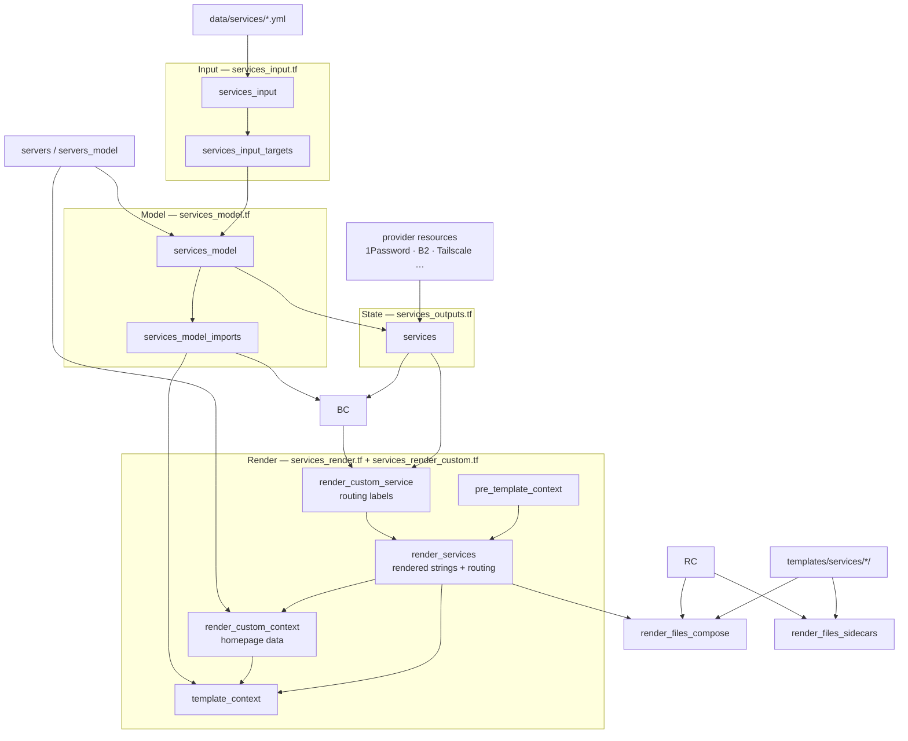

# Homelab

[](LICENSE)
[](https://opentofu.org/)
[](https://github.com/maxexcloo/homelab)

Infrastructure as code for homelab management using OpenTofu.

## Quick Start

```bash
# Clone repository
git clone https://github.com/maxexcloo/homelab.git
cd homelab

# Setup
mise run setup  # Creates .mise.local.toml template
mise run init   # Initialize OpenTofu

# Deploy
mise run plan   # Review changes
mise run apply  # Apply changes
```

## Prerequisites

- [mise](https://mise.jdx.dev/) for task management and tool installation
- 1Password Connect server with access to the server and service credential vaults listed in `data/config.yml`
- Terraform Cloud account for state backend

Run `mise run setup` to create `.mise.local.toml` from the template, then fill in credentials for the providers used by the current data files. See `.mise.local.toml.default` for the full list.

The provider lock file (`.terraform.lock.hcl`) should be committed when provider selections change. The `.terraform/` plugin directory and any plan/state files stay local.

## Architecture

YAML files in `data/` are the source of truth. OpenTofu reads them, computes derived values, and provisions resources across the integrated providers. Some service credentials are rendered directly because no provider resource manages them.

Server and service data flows through four pipeline stages: **input** (YAML with defaults merged, then target keys expanded), **model** (FQDNs, groups, and URLs computed deterministically — safe for `for_each`), **state** (provider-backed secrets and fields attached), and **render** (dashboard and data strings templated, Traefik labels generated, Compose and sidecar artifacts produced). Consumers use narrower views for 1Password, templates, public inventory, and outputs so dependencies stay visible.

### Services Pipeline



```
data/
├── dns/*.yml                           # DNS zones and manual records
├── servers/*.yml                       # Server definitions
├── services/*.yml                      # Service deployments
├── config.yml                          # Global configuration (domains, accounts, system, types) — kept separate from defaults.yml so edits to one don't churn the other
└── defaults.yml                        # Field defaults merged into every server/service/DNS record
templates/
└── services/<identity.service>/        # Templates for services with an implementation key
    │
    ▼
OpenTofu
    ├── 1Password       Credential storage (one entry per server/service)
    ├── B2              Object storage buckets and keys
    ├── Cloudflare      DNS records, Zero Trust tunnels, ACME tokens
    ├── GitHub          SSH public keys; pushes Fly/Komodo/TrueNAS configs
    ├── Incus           Containers and VMs on managed hosts
    ├── OCI             Oracle Cloud VMs and networking
    ├── Pushover        Pass-through alert notification credentials
    ├── Resend          Email API keys
    └── Tailscale       VPN auth keys, ACLs, and device lookups
```

Rendered service configs (Docker Compose, Fly.toml, TrueNAS app values) are SOPS-encrypted and pushed to the platform-specific GitHub repos listed in `data/config.yml`. Each deploy repo also gets `.github/deploy-request.json`, written after rendered files, SOPS config, and the workflow. Push deploys only trigger from that manifest and compare fingerprints with the previous manifest, so changed Fly apps or TrueNAS `server/service` targets deploy after the render commits settle. TrueNAS deploys can also be started manually with an empty target for everything, a server key, a service key, or `server/service`. TrueNAS catalog updates apply desired values as an overlay on the current app config, so per-app values files only need to include managed keys.

Rendered plaintext can be written locally for debugging with `mise run render`, which writes through `debug_dir` to `.render` by default. For ad hoc runs, set `TF_VAR_debug_dir` to a scratch path such as `/tmp/homelab-debug`.

Feature flags either create provider-backed resources, expose values generated locally by OpenTofu, or control rendered config. `password` and `monitoring`/`monitoring_alerts` are local-only; `b2`, `resend`, and `tailscale` call providers when enabled. Resend uses the generic REST API provider with `TF_VAR_resend_api_key`. Pushover has no provider-managed resource here, so `TF_VAR_pushover_application_token` and `TF_VAR_pushover_user_key` are pass-through values rendered into config when `features.pushover` is enabled.

## Service Data And Templates

Service YAML can include a root `data` value with any JSON-compatible shape: objects, arrays, strings, numbers, booleans, or null. Templates receive the rendered value as `service.data`. String values anywhere inside that JSON tree support OpenTofu template interpolation using `defaults`, `server`, `servers`, `service`, and `services`.

Targets can also set `targets.<key>.data`. If both service-level and target-level values are objects, they are deep-merged with target values winning. If either side is a scalar, array, or null, the target value replaces the service value. Use this for general application data such as bookmark lists, dashboard settings, upstream URLs, or provider-neutral config that belongs with the service but should not become root HCL logic.

Templates can reference:

- `defaults` - merged global defaults and config
- `server` - the target server when the service runs on a managed server, otherwise null
- `servers` - all modeled servers
- `service` - the current expanded service, including rendered `data`, `dashboard`, and `routing_labels`
- `services` - all expanded services plus declared `imports.services` aliases overlaid by alias

## Workflow

### Adding Servers

1. Create `data/servers/<key>.yml` following `schemas/server.json`
2. Fill in `platform`, `type`, `features`, `identity`, `networking`
3. Run `mise run plan` to review, `mise run apply` to provision

### Adding Services

1. Create `data/services/<key>.yml` following `schemas/service.json`
2. Fill in `features`, `identity`, `routing`, and at least one entry under `targets:` (server key or `fly`)
3. Set `identity.service` only when the service has templates/deploy artifacts; omit it for dashboard/inventory-only services
4. Each target may carry `features`, `fly`, and `truenas` overlays; target values win over service-level values
5. Put provider-neutral app lists/settings under `data`; use `targets.<key>.data` for per-target overrides
6. For Fly.io deployments, optionally set `targets.fly.fly.app_name`; otherwise it defaults to `<org>-<identity.name>` and the Fly hostname is added to computed service URLs
7. Optionally add deploy artifacts under `templates/services/<identity.service>/`; use `.tftpl` for files that need OpenTofu template rendering and `.raw.tftpl` for rendered files that must be encrypted as binary
8. Run `mise run plan` to review, `mise run apply` to provision

## Commands

```bash
mise run apply       # Apply infrastructure changes
mise run check       # Format check, lint, and validate
mise run fmt         # Format HCL and YAML data files
mise run init        # Initialize OpenTofu providers and backend
mise run lint        # Validate YAML data files against JSON schemas (runs sort-check first)
mise run plan        # Review infrastructure changes
mise run refresh     # Check for configuration drift
mise run setup       # Initial project setup
mise run sort-check  # Check YAML and JSON Schema key ordering
mise run validate    # Validate OpenTofu configuration
```

## Credential Storage

All generated credentials are stored automatically in **1Password** through 1Password Connect:

- **Servers vault** — one login entry per server; generated fields (passwords, API keys, tunnel tokens) are stored as fields, and IPs/FQDNs are stored as item URLs
- **Services vault** — one login entry per service deployment with the same pattern, preserving all computed and custom URLs on the login item

Set `onepassword.vaults.servers.id` and `onepassword.vaults.services.id` in `data/config.yml` to the target 1Password vault UUIDs, and set `TF_VAR_onepassword_connect_url` plus `TF_VAR_onepassword_connect_token` for the Connect API.

Each server and service exposes runtime data through a `state` sub-object split into `state.fields` (1Password STRING entries), `state.secrets` (CONCEALED entries), and `state.urls` (URL items). Templates reach in via `${server.state.secrets.password}` or `${service.state.fields.b2_bucket_name}` etc. — no `_sensitive` suffix.

Manually supplied service secrets are declared in `secrets` with only a `name`. OpenTofu creates empty concealed fields for those secrets on the matching 1Password service item, then reads populated values back and exposes them as `service.state.secrets.{name}` in templates. After adding a new manual service secret, apply once to create the empty field, fill it in 1Password, then apply again to render and deploy the populated value. Add `bootstrap_type` and `bootstrap_length` when OpenTofu should generate the initial value.

Services can access another service's full data (including secrets) only by declaring an `imports.services` alias. The normal `services` map remains the inventory, and declared imports are overlaid by alias as `services.<alias>`.

Rendered sidecar files named `*.raw.tftpl` are templated, encrypted as binary, and deployed without the `.raw` segment. Use this for files where SOPS structured YAML/JSON encryption is unsuitable, such as top-level YAML arrays.

## Documentation

- [AGENTS.md](AGENTS.md) - Development guide and standards

## License

AGPL-3.0 - see [LICENSE](LICENSE)
